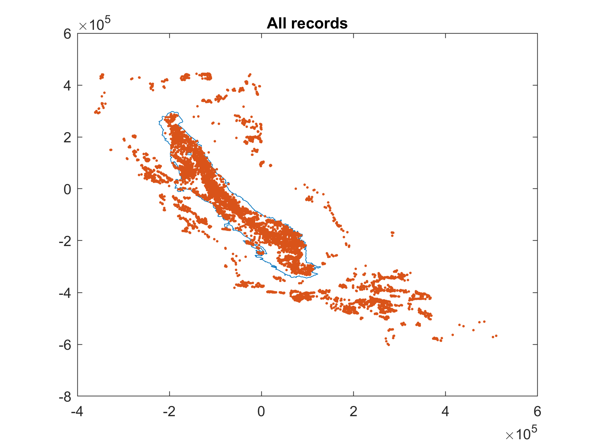
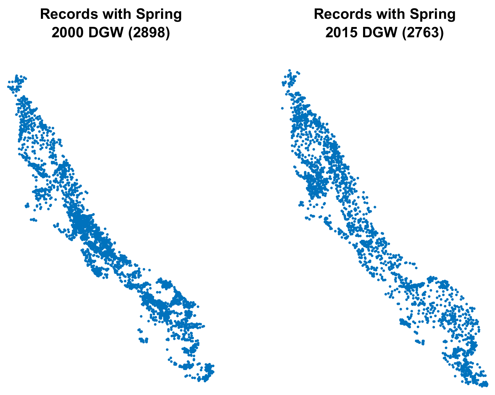

# Central Valley Unsaturated zone travel time
In this repository we provide information and the data for the estimation of the unsaturated travel time in Central Valley.

In addition to the methodology we provide matlab code snippets. Those snippets use a few matlab functions that are part of the [gwtools](https://github.com/UCD-GW-Nitrate/gwtools) package.

# Methodology
The travel time $\tau$ assuming vertical water movement can be estimated by the following equation:

$$\tau = \theta_m \frac{D_{gw}}{R}$$

where $\theta_m$  is the deep vadose zone water content or mobile water content $[L^3/L^3]$, $D_{gw}$ is the depth from soil surface to the water table $[L]$ and $R$ is the groundwater recharge $[L/T]$.

The mobile water content is a dimensionless coefficient that can be used to scale the overall travel time.

In the following paragraph we describe the approach to estimate the Depth and groundwater recharge.

## Groundwater recharge
For the groundwater recharge estimation we rely on groundwater modeling. In Central Valley there are 2 important regional models the [Central Valley Hydrologic model (CVHM)](https://ca.water.usgs.gov/projects/central-valley/central-valley-hydrologic-model.html) and the [California Central Valley Groundwater-Surface Simulation Model (C2VSim)](https://data.cnra.ca.gov/dataset/c2vsimfg-version-1-01). Here we use the C2VSim model however the same analysis can be done with CVHM.

Set the C2VSim path. `c2vsim_path` is the folders where the `Simulation` and `Results` folders are.
```
c2vsim_path = fullfile('path','to','c2vsim');
```

Read the groundwater recharge data for each element from the groundwater element zone budget file. See [this post](https://subsurface.gr/reading-iwfm-c2vsim-output-files/) for detailed explanation of reading process 
```
GBinfo = h5info(fullfile(c2vsim_path, "Results",'C2VSimFG_GW_ZBudget.hdf'));
colIDnames = h5read(GBinfo.Filename,...
    [GBinfo.Groups(1).Name GBinfo.Name GBinfo.Groups(1).Datasets(5).Name]);
colIDs = h5read(GBinfo.Filename,...
    [GBinfo.Groups(1).Name GBinfo.Name GBinfo.Groups(1).Datasets(6).Name]);
```
In C2VSim the groundwater recharge is divided into three components. See more about groundwater recharge in C2VSim [here](https://giorgk.users.earthengine.app/view/c2vsim-recharge-xplr) and the associated [documentation](https://gwt.ucdavis.edu/blog/c2vsim-swat-groundwater-recharge-link)
1. Deep percolation corresponds to groundwater recharge primarily from agriculture and  other sources such as native vegetation, refuge, urban and rice.
2. Diversions which is recharge from managed or unmanaged aquifer recharge
3. Bypass flows which is rechareg from canals and ditches.

#### Read percolation
```
DeepPerc = h5read(GBinfo.Filename,...
    [GBinfo.Groups(2).Name GBinfo.Name GBinfo.Groups(2).Datasets(5).Name])
```
#### Read Diversions
```
DivLoss = zeros(size(DeepPerc));
tmp = h5read(GBinfo.Filename,...
    [GBinfo.Groups(2).Name GBinfo.Name GBinfo.Groups(2).Datasets(7).Name]);
divElIds = find(colIDs(:,17) ~= 0);
DivLoss(divElIds,:) = tmp;
```
#### Read Bypass flows
```
ByPassLoss = zeros(size(DeepPerc));
tmp = h5read(GBinfo.Filename,...
    [GBinfo.Groups(2).Name GBinfo.Name GBinfo.Groups(2).Datasets(1).Name]);
bypassElIds = find(colIDs(:,19) ~= 0);
ByPassLoss(bypassElIds,:) = tmp;
```
Next we add the 3 recharge volumes
```
c2vsimRch = DeepPerc + DivLoss + ByPassLoss;
```
To calculate $R$ we will use two representative recharge rates that correspond to the average rates of spring 2000 and spring 2015. Next we find the indices for these periods
```
idx_2000 = find(c2vsimTime == datetime('31-Mar-2000')):find(c2vsimTime == datetime('31-May-2000'));
idx_2015 = find(c2vsimTime == datetime('31-Mar-2015')):find(c2vsimTime == datetime('31-May-2015'));
```
The units of recharge in the hdf output files are in `cuft/month`. Here we calculate the total amount of spring recharge and divide it by the numbers of spring days and convert it to meter so the units now are `m^3/day`.
```
Rch_2000 = (0.3048^3)*sum(c2vsimRch(:,idx_2000),2)./sum(c2vsimTime(idx_2000).Day);
Rch_2015 = (0.3048^3)*sum(c2vsimRch(:,idx_2015),2)./sum(c2vsimTime(idx_2015).Day)
```
Finaly to convert the recharge volume to rate we need the area of each element, which we could read from the groundwater zone budget output file
```
ElemArea = h5read(GBinfo.Filename,...
    [GBinfo.Groups(1).Name GBinfo.Name GBinfo.Groups(1).Datasets(12).Name]);
ElemArea = ElemArea*(0.3048^2);
```
However because we will need the element barycenters at a later step we will calculate both the areas and barycenters using the element shapefile
```
ElemArea = zeros(length(c2vsim_mesh),1);
bc_elem = zeros(length(c2vsim_mesh),2);
for ii = 1:length(c2vsim_mesh)
    ElemArea(ii,1) = polyarea(c2vsim_mesh(ii,1).X(1:end-1), c2vsim_mesh(ii,1).Y(1:end-1));
    bc_elem(ii,:) = [mean(c2vsim_mesh(ii,1).X(1:end-2)) mean(c2vsim_mesh(ii,1).Y(1:end-2))];
end
```
Now we can calculate the recharge rates. Here convert them to `mm/year`
```
Rch_2000 = 1000*365*Rch_2000./ElemArea;
Rch_2015 = 1000*365*Rch_2015./ElemArea;
```
The histogram of groundwater recharge for the two time periods is show below


---------
## Depth to groundwater table
### Prepare the measures water level data
For the depth to water table we rely on water level measurments. The data we use in the following can be found under our [cv unsat data folder](https://ucdavis.box.com/s/2sgyg7gc7kaem01j0olpumm6xml7h7ji). These are processed data. The original data were obtained by DWR.
```
gwl_data1 = readtable('gwl_file_part_1.xlsx');
gwl_data2 = readtable('gwl_file_part_2.xlsx');
gwl_data3 = readtable('gwl_file_part_3.xlsx');
```
Join the three tables but keep only the data we need 
```
columns_to_keep = ["Var2","Var4","Var5","Var6","Var7","Var8"];
gwl_data = [gwl_data1(:,columns_to_keep) 
    gwl_data2(:,columns_to_keep)
    gwl_data3(:,columns_to_keep)];
gwl_data.Properties.VariableNames = {'Section', 'Date','Var5','Var6','Var7','Var8'};
gwl_data.Section = categorical(gwl_data.Section);
```
Keep the data of spring 2000 and 2015
```
gwl_data = gwl_data((gwl_data.Date >= datetime(2000,2,1) & gwl_data.Date <= datetime(2000,5,31)) | ...
                    (gwl_data.Date >= datetime(2015,2,1) & gwl_data.Date <= datetime(2015,5,31)),:);
```
From those fields calculate the depth to groundwater
```
gwl_data.DGW = gwl_data.Var8 - (gwl_data.Var5 - gwl_data.Var6);
gwl_data(:,["Var5","Var6","Var7","Var8"]) = [];
gwl_data(isnan(gwl_data.DGW),:) = [];
```
Read the spreadsheet with the coordinate information
```
gst = readtable(fullfile('..','..','Box','cv-unsat','gst_file.xlsx'));
gst.SITE_CODE = categorical(gst.SITE_CODE);
```
Append coordinates to the groundwater level data table
```
[Lia, Locb] = ismember(gwl_data.Section, gst.SITE_CODE);
gwl_data.Lat(Lia) = gst.LATITUDE(Locb(Lia));
gwl_data.Lon(Lia) = gst.LONGITUDE(Locb(Lia));
gwl_data = gwl_data(Lia,:);
```
For each section it is possible to have multiple well records. Here we isolate a list of unique sections
```
trs_unique = unique(gwl_data.Section);
GWL = table(trs_unique,'VariableNames', {'Section'});
```
Loop through the wells and calculate the mean depth for 2000 and 2015
```
for ii = 1:size(GWL,1)
    ind = find(gwl_data.Section == GWL.Section(ii));
    if ~isempty(ind)
        GWL.Lat(ii) = gwl_data.Lat(ind(1));
        GWL.Lon(ii) = gwl_data.Lon(ind(1));
        % find records for spring 2000
        iyr = year(gwl_data.Date(ind)) == 2000;
        GWL.DGW_2000(ii) = mean(gwl_data.DGW(ind(iyr)));
        % find records for spring 2015
        iyr = year(gwl_data.Date(ind)) == 2015;
        GWL.DGW_2015(ii) = mean(gwl_data.DGW(ind(iyr)));
    end
end
```
Isolate the records that are within the Central Valley. Read the Central Valley shapefile 
```
CV_outline = shaperead(fullfile('path','to','gis_data','C2VSim_Outline_3310'));
```
Plot all record data
```
plot(CV_outline.X, CV_outline.Y)
[xx,yy] = projfwd(projcrs(3310),GWL.Lat, -GWL.Lon);
hold on
plot(xx,yy,'.')
title('All records')
hold off
```


Remove the wells outside Central Valley
```
CV_outline_shape = polyshape(CV_outline.X, CV_outline.Y);
in_cv = CV_outline_shape.isinterior(xx,yy);
GWL(~in_cv,:) = [];
```
Compare the well records between 2000 and 2015 years
```
subplot(1,2,1);
plot(-GWL.Lon(~isnan(GWL.DGW_2000)), GWL.Lat(~isnan(GWL.DGW_2000)),'.')
title({'Records with Spring',['2000 DGW (' num2str(sum(~isnan(GWL.DGW_2000))) ')']})
axis equal
axis off
subplot(1,2,2);
plot(-GWL.Lon(~isnan(GWL.DGW_2015)), GWL.Lat(~isnan(GWL.DGW_2015)),'.')
title({'Records with Spring',['2015 DGW (' num2str(sum(~isnan(GWL.DGW_2015))) ')']})
axis equal
axis off
```


### Condition Simulated data to measured data
Because the measured data have significant gaps we will use the simulated data which cover the CV however they contain errors. The goal here is to adjust the errors based on the water level measurment data

First read the simulated data. (This is going to take sometime)
```
C2VsimHead = readIWFM_headalloutput(fullfile(c2vsim_path,'Results','C2VSimFG_GW_HeadAll.out'), 30179, 4, 505, 1);
```
Calculate the simulated average water table for spring 2000 and 2015. 
The data are in feet therefore we convert the water table elevation in meters.
```
sim_wtbl_2000 = 0.3048 * (C2VsimHead{319,2}(:,1) + C2VsimHead{320,2}(:,1) + C2VsimHead{321,2}(:,1))/3;
sim_wtbl_2015 = 0.3048 * (C2VsimHead{499,2}(:,1) + C2VsimHead{500,2}(:,1) + C2VsimHead{501,2}(:,1))/3;
```
To calculate the depth to water we read the C2VSim groundwater surface elevation and convert it to meters
```
cv_nodes = readIWFM_Nodes(fullfile(c2vsim_path, 'Preprocessor','C2VSimFG_Nodes.dat'));
cv_gse = readIWFM_Stratigraphy(fullfile(c2vsim_path,'Preprocessor','C2VSimFG_Stratigraphy.dat'),30179, 4, 105);
cv_gse = 0.3048 * cv_gse(:,2);
```
The simulated depth to groundwater can now be calculated as:
```
sim_dgw_2000 = cv_gse - sim_wtbl_2000;
sim_dgw_2015 = cv_gse - sim_wtbl_2015;
```
The simulated and measured data have to be under the same coordinate system. In the following snippet we convert the measurment data from lat long to 3310 and the simulated data from 26910 to 3310
```
[GWL.X_3310, GWL.Y_3310] = projfwd(projcrs(3310),GWL.Lat, -GWL.Lon); 
GWL.DGW_2000 = GWL.DGW_2000*0.3048;
GWL.DGW_2015 = GWL.DGW_2015*0.3048;

[lat,lon] = projinv(projcrs(26910), [c2vsim_nodes.X]', [c2vsim_nodes.Y]');
[simX3310, simY3310] = projfwd(projcrs(3310),lat, lon);
```
To make the conditioning process easier we will create interpolants for the measured and simulated data
```
Fmeas2000 = scatteredInterpolant(GWL.X_3310(~isnan(GWL.DGW_2000)), ...
    GWL.Y_3310(~isnan(GWL.DGW_2000)), GWL.DGW_2000(~isnan(GWL.DGW_2000)), 'linear', 'nearest');
Fmeas2015 = scatteredInterpolant(GWL.X_3310(~isnan(GWL.DGW_2015)), ...
    GWL.Y_3310(~isnan(GWL.DGW_2015)), GWL.DGW_2015(~isnan(GWL.DGW_2015)), 'linear', 'nearest');

Fsim2000 = scatteredInterpolant(simX3310, simY3310, sim_dgw_2000, 'linear', 'nearest');
Fsim2015 = scatteredInterpolant(simX3310, simY3310, sim_dgw_2015, 'linear', 'nearest');
```
### Conditioning steps

1. Calculate the simulated values on the points where we have measurements.
```
DGW2000sim = Fsim2000(Fmeas2000.Points(:,1), Fmeas2000.Points(:,2));
DGW2015sim = Fsim2015(Fmeas2015.Points(:,1), Fmeas2015.Points(:,2));
```
2. Create interpolants using the simulated values at the measured locations
```
Fmeas2000sim = scatteredInterpolant(Fmeas2000.Points(:,1), Fmeas2000.Points(:,2), DGW2000sim, 'linear','nearest');
Fmeas2015sim = scatteredInterpolant(Fmeas2015.Points(:,1), Fmeas2015.Points(:,2), DGW2015sim, 'linear','nearest');
```
3. Interpolate a simulated DGW on the c2vsim nodes using the measurement points with the simulated interpolated values on them
```
SimMeas2000 = Fmeas2000sim(simX3310, simY3310);
SimMeas2015 = Fmeas2015sim(simX3310, simY3310);
```
4. The difference between the actual simulated DGW and the interpolated simulated DGW using the density of the measured data is the interpolation error that an interpolation on measured points would produce 
```
measError2000 = Fsim2000.Values - SimMeas2000;
measError2015 = Fsim2015.Values - SimMeas2015;
```
5. Use the actual measurement data to interpolate on the c2vsim nodes
```
MeasInterp2000 = Fmeas2000(simX3310, simY3310);
MeasInterp2015 = Fmeas2015(simX3310, simY3310);
```
6. Finaly we correct the interpolation by adding the interpolated error
```
DGW2000 = MeasInterp2000 + measError2000;
DGW2015 = MeasInterp2015 + measError2015;
```