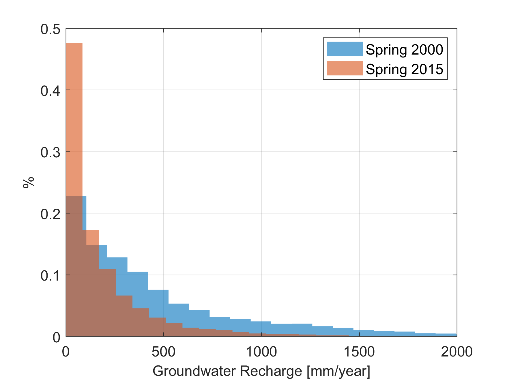

# Central Valley Unsaturated zone travel time
In this repository we provide information and the data for the estimation of the unsaturated travel time in Central Valley.

In addition to the methodology we provide matlab code snippets. Those snippets use a few matlab functions that are part of the [gwtools](https://github.com/UCD-GW-Nitrate/gwtools) package.

# Methodology
The travel time $\tau$ assuming vertical water movement can be estimated by the following equation:

$$\tau = \theta_m \frac{D_{gw}}{R}$$

where $\theta_m$  is the deep vadose zone water content or mobile water content $[L^3/L^3]$, $D_{gw}$ is the depth from soil surface to the water table $[L]$ and $R$ is the groundwater recharge $[L/T]$.

The mobile water content is a dimensionless coefficient that can be used to scale the overall travel time.

In the following paragraph we describe the approach to estimate the Depth and groundwater recharge.

## Groundwater recharge
For the groundwater recharge estimation we rely on groundwater modeling. In Central Valley there are 2 important regional models the [Central Valley Hydrologic model (CVHM)](https://ca.water.usgs.gov/projects/central-valley/central-valley-hydrologic-model.html) and the [California Central Valley Groundwater-Surface Simulation Model (C2VSim)](https://data.cnra.ca.gov/dataset/c2vsimfg-version-1-01). Here we use the C2VSim model however the same analysis can be done with CVHM.

Set the C2VSim path. `c2vsim_path` is the folders where the `Simulation` and `Results` folders are.
```
c2vsim_path = fullfile('path','to','c2vsim');
```

Read the groundwater recharge data for each element from the groundwater element zone budget file. See [this post](https://subsurface.gr/reading-iwfm-c2vsim-output-files/) for detailed explanation of reading process 
```
GBinfo = h5info(fullfile(c2vsim_path, "Results",'C2VSimFG_GW_ZBudget.hdf'));
colIDnames = h5read(GBinfo.Filename,...
    [GBinfo.Groups(1).Name GBinfo.Name GBinfo.Groups(1).Datasets(5).Name]);
colIDs = h5read(GBinfo.Filename,...
    [GBinfo.Groups(1).Name GBinfo.Name GBinfo.Groups(1).Datasets(6).Name]);
```
In C2VSim the groundwater recharge is divided into three components. See more about groundwater recharge in C2VSim [here](https://giorgk.users.earthengine.app/view/c2vsim-recharge-xplr) and the associated [documentation](https://gwt.ucdavis.edu/blog/c2vsim-swat-groundwater-recharge-link)
1. Deep percolation corresponds to groundwater recharge primarily from agriculture and  other sources such as native vegetation, refuge, urban and rice.
2. Diversions which is recharge from managed or unmanaged aquifer recharge
3. Bypass flows which is rechareg from canals and ditches.

#### Read percolation
```
DeepPerc = h5read(GBinfo.Filename,...
    [GBinfo.Groups(2).Name GBinfo.Name GBinfo.Groups(2).Datasets(5).Name])
```
#### Read Diversions
```
DivLoss = zeros(size(DeepPerc));
tmp = h5read(GBinfo.Filename,...
    [GBinfo.Groups(2).Name GBinfo.Name GBinfo.Groups(2).Datasets(7).Name]);
divElIds = find(colIDs(:,17) ~= 0);
DivLoss(divElIds,:) = tmp;
```
#### Read Bypass flows
```
ByPassLoss = zeros(size(DeepPerc));
tmp = h5read(GBinfo.Filename,...
    [GBinfo.Groups(2).Name GBinfo.Name GBinfo.Groups(2).Datasets(1).Name]);
bypassElIds = find(colIDs(:,19) ~= 0);
ByPassLoss(bypassElIds,:) = tmp;
```
Next we add the 3 recharge volumes
```
c2vsimRch = DeepPerc + DivLoss + ByPassLoss;
```
To calculate $R$ we will use two representative recharge rates that correspond to the average rates of spring 2000 and spring 2015. Next we find the indices for these periods
```
idx_2000 = find(c2vsimTime == datetime('31-Mar-2000')):find(c2vsimTime == datetime('31-May-2000'));
idx_2015 = find(c2vsimTime == datetime('31-Mar-2015')):find(c2vsimTime == datetime('31-May-2015'));
```
The units of recharge in the hdf output files are in `cuft/month`. Here we calculate the total amount of spring recharge and divide it by the numbers of spring days and convert it to meter so the units now are `m^3/day`.
```
Rch_2000 = (0.3048^3)*sum(c2vsimRch(:,idx_2000),2)./sum(c2vsimTime(idx_2000).Day);
Rch_2015 = (0.3048^3)*sum(c2vsimRch(:,idx_2015),2)./sum(c2vsimTime(idx_2015).Day)
```
Finaly to convert the recharge volume to rate we need the area of each element, which we could read from the groundwater zone budget output file
```
ElemArea = h5read(GBinfo.Filename,...
    [GBinfo.Groups(1).Name GBinfo.Name GBinfo.Groups(1).Datasets(12).Name]);
ElemArea = ElemArea*(0.3048^2);
```
However because we will need the element barycenters at a later step we will calculate both the areas and barycenters using the element shapefile
```
ElemArea = zeros(length(c2vsim_mesh),1);
bc_elem = zeros(length(c2vsim_mesh),2);
for ii = 1:length(c2vsim_mesh)
    ElemArea(ii,1) = polyarea(c2vsim_mesh(ii,1).X(1:end-1), c2vsim_mesh(ii,1).Y(1:end-1));
    bc_elem(ii,:) = [mean(c2vsim_mesh(ii,1).X(1:end-2)) mean(c2vsim_mesh(ii,1).Y(1:end-2))];
end
```
Now we can calculate the recharge rates. Here convert them to `mm/year`
```
Rch_2000 = 1000*365*Rch_2000./ElemArea;
Rch_2015 = 1000*365*Rch_2015./ElemArea;
```
The histogram of groundwater recharge for the two time periods is show below


---------
## Depth to groundwater table
For the depth to water table we rely primarily on water level measurments. We provide in this repository the processed data as spreadsheets. The original data are coming from DWR.

